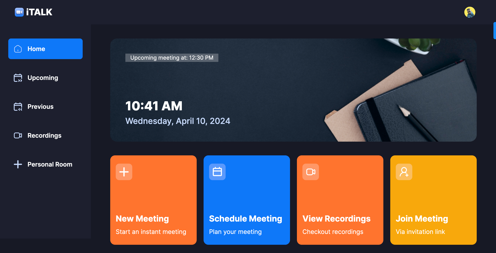

<a name="readme-top"></a>

<div align="center">

  <br/>
  <h1>iTALK</h1>

</div>

## 📗 Table of Contents

- [📖 About the Project](#about-project)
  - [🛠 Built With ](#-built-with-)
  - [Tech Stack ](#tech-stack-)
  - [Key Features ](#key-features-)
  - [🚀 Live Demo](#live-demo)
- [💻 Getting Started ](#-getting-started-)
  - [Prerequisites](#prerequisites)
  - [Setup](#setup)
  - [Install](#install)
  - [👥 Authors ](#-authors-)
  - [🤝 Contributing ](#-contributing-)
  - [⭐️ Show your support ](#️-show-your-support-)
  - [📝 License ](#-license-)

<!-- PROJECT DESCRIPTION -->

# iTALK <a name="about-project"></a>

This project utilizes cutting-edge technologies including Next.js and TypeScript to emulate the functionality of Zoom, a popular video conferencing platform. It empowers users to securely authenticate, initiate meetings, and leverage a multitude of meeting features such as recording sessions, screen sharing capabilities, and participant management tools.



## 🛠 Built With <a name="built-with"></a>

### Tech Stack <a name="tech-stack"></a>
    - Next.js
    - TypeScript
    - Clerk
    - getstream
    - shadcn
    - Tailwind CSS

<!-- Features -->

### Key Features <a name="key-features"></a>

👉 Authentication: Implements authentication and authorization features using Clerk, allowing users to securely log in via social sign-on or traditional email and password methods, while ensuring appropriate access levels and permissions within the platform.

👉 New Meeting: Quickly start a new meeting, configuring camera and microphone settings before joining.

👉 Meeting Controls: Participants have full control over meeting aspects, including recording, emoji reactions, screen sharing, muting/unmuting, sound adjustments, grid layout, participant list view, and individual participant management (pinning, muting, unmuting, blocking, allowing video share).

👉 Exit Meeting: Participants can leave a meeting, or creators can end it for all attendees.

👉 Schedule Future Meetings: Input meeting details (date, time) to schedule future meetings, accessible on the 'Upcoming Meetings' page for sharing the link or immediate start.

👉 Past Meetings List: Access a list of previously held meetings, including details and metadata.

👉 View Recorded Meetings: Access recordings of past meetings for review or reference.

👉 Personal Room: Users have a personal room with a unique meeting link for instant meetings, shareable with others.

👉 Join Meetings via Link: Easily join meetings created by others by providing a link.

👉 Secure Real-time Functionality: All interactions within the platform are secure and occur in real-time, maintaining user privacy and data integrity.

👉 Responsive Design: Follows responsive design principles to ensure optimal user experience across devices, adapting seamlessly to different screen sizes and resolutions.

and many more, including code architecture and reusability.

## 🚀 Live Demo <a name="live-demo"></a>

 Click on this [iTALK Live Demo](#) to view the live-demo of project
<p align="right">(<a href="#readme-top">back to top</a>)</p>

<p align="right">(<a href="#readme-top">back to top</a>)</p>

<!-- GETTING STARTED -->

## 💻 Getting Started <a name="getting-started"></a>

### Prerequisites

Make sure you have the following installed on your machine:

- [Git](https://git-scm.com/)
- [Node.js](https://nodejs.org/en)
- [npm](https://www.npmjs.com/) (Node Package Manager)

### Setup

<Strong>Cloning the Repository</Strong>

```sh
git clone https://github.com/binodbhusal/italk.git
```

```sh
cd iTALK
```

````

```sh
npm install
````

```sh
npm start
```
**Set Up Environment Variables**

Create a new file named `.env` in the root of your project and add the following content:

```env
NEXT_PUBLIC_CLERK_PUBLISHABLE_KEY=
CLERK_SECRET_KEY=

NEXT_PUBLIC_CLERK_SIGN_IN_URL=/sign-in
NEXT_PUBLIC_CLERK_SIGN_UP_URL=/sign-up

NEXT_PUBLIC_STREAM_API_KEY=
STREAM_SECRET_KEY=
```
**Running the Project**

```bash
npm run dev
```

Open [http://localhost:3000](http://localhost:3000) in your browser to view the project.

<p align="right">(<a href="#readme-top">back to top</a>)</p>

<!-- AUTHORS -->

## 👥 Authors <a name="authors"></a>

### 👤 **Binod Bhusal**

- GitHub: [@binodbhusal](https://github.com/binodbhusal)
- Twitter: [@twitter](https://twitter.com/Binod_ironLad)
- LinkedIn: [@linkedin](https://www.linkedin.com/in/binodbhusal/)

## 🤝 Contributing <a name="contributing"></a>

Contributions, issues, and feature requests are welcome!

Feel free to check the [issues page](https://github.com/binodbhusal/italk/issues).

<p align="right">(<a href="#readme-top">back to top</a>)</p>

<!-- SUPPORT -->

## ⭐️ Show your support <a name="support"></a>

If you liked this project, give it a ⭐️ and kindly send to me an e-mail expressing it, it would make our day and fuel our motivation.

<p align="right">(<a href="#readme-top">back to top</a>)</p>

<p align="right">(<a href="#readme-top">back to top</a>)</p>

<!-- LICENSE -->

## 📝 License <a name="license"></a>

This project is [MIT](./LICENSE.md) licensed.

<p align="right">(<a href="#readme-top">back to top</a>)</p>
